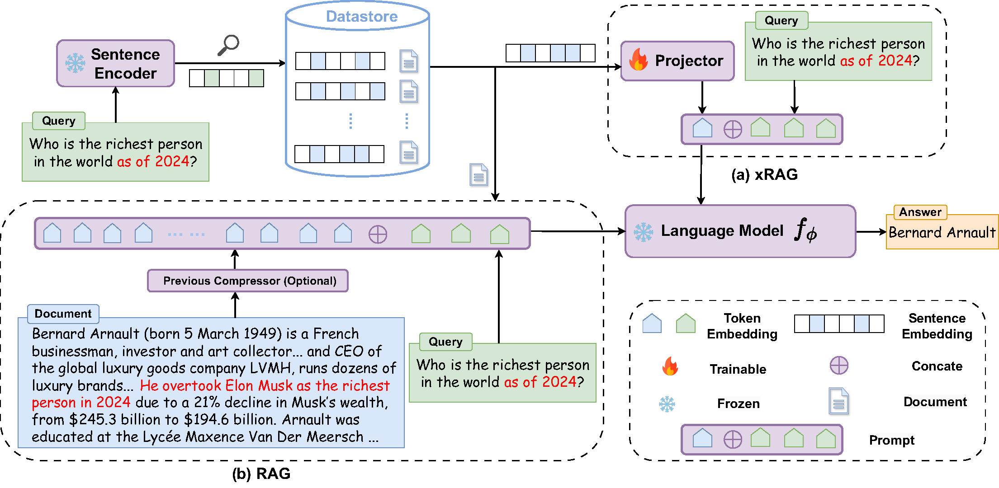

# xRAG

Official repo for [xRAG: Extreme Context Compression for Retrieval-augmented Generation with One Token](https://arxiv.org/abs/2405.13792)

<div align=center>

</div>


## Get Started
Refer to `Dockerfile` for required packages

Configure `wandb` and `accelerate`
```bash
wandb login
accelerate config
```

## Pretrained Checkpoints
HuggingFace
| Model                 | Backbone | Download                                                                    |
|-----------------------|-----------------|-----------------------------------------------------------------------------|
| xRAG-7b | [mistralai/Mistral-7B-Instruct-v0.2](https://huggingface.co/mistralai/Mistral-7B-Instruct-v0.2)            | [🤗 Hugging Face](https://huggingface.co/Hannibal046/xrag-7b) |
| xRAG-MoE | [mistralai/Mixtral-8x7B-Instruct-v0.1](https://huggingface.co/mistralai/Mixtral-8x7B-Instruct-v0.1)            | [🤗 Hugging Face](https://huggingface.co/Hannibal046/xrag-moe) |


## Tutorial

We provide a tutorial for xRAG in `tutorial.ipynb`. Check it out!

## Data
- download [enwiki-dec2021](https://github.com/facebookresearch/atlas?tab=readme-ov-file#models) as pretraining data and corpus for retrieval
- prepare instruction tuning data in `prepare_data.ipynb`
- download [TriviaQA](https://drive.google.com/drive/folders/1lFFTklW_0HuR53hLpFdLClgfSAhXn_2f)
- using [ColBERT-v2](https://github.com/stanford-futuredata/ColBERT.git) to conduct retrieval

## Training
Training scripts in `scripts/`, for example, to train a Mistral-7b with SFR:
```bash
accelerate launch \
    --mixed_precision bf16 \
    --num_machines 1 \
    --num_processes 8 \
    --main_process_port 29666 \
    -m \
    src.language_modeling.train \
    --config config/language_modeling/pretrain.yaml \
```
## Evaluation
The evaluation code is in `src/eval`. For example, to evaluate on TriviaQA:

without retrieval augmentation:
```bash
CUDA_VISIBLE_DEVICES=0 python -m src.eval.run_eval \
        --data triviaqa \
        --model_name_or_path Hannibal046/xrag-7b
```

with retrieval augmentation:
```bash
CUDA_VISIBLE_DEVICES=0 python -m src.eval.run_eval \
        --data triviaqa \
        --model_name_or_path Hannibal046/xrag-7b \
        --use_rag
```

with xRAG:
```bash
CUDA_VISIBLE_DEVICES=0 python -m src.eval.run_eval \
        --data triviaqa \
        --model_name_or_path Hannibal046/xrag-7b \
        --retriever_name_or_path Salesforce/SFR-Embedding-Mistral \
        --use_rag
```

## Benchmark
To benchmark xRAG, we provide the code in `src/language_modeling/profiler.py`.
```
python -m src.language_modeling.profiler --instruction_length 54 --generation_length 30 --dataset triviaqa --use_xrag
python -m src.language_modeling.profiler --instruction_length 54 --generation_length 30 --dataset triviaqa
```
